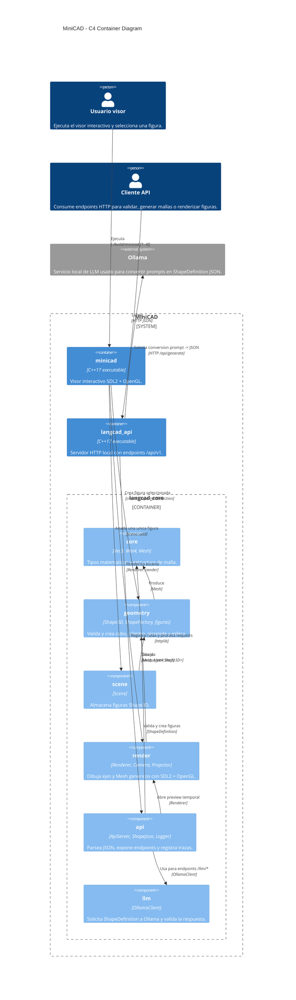

# MiniCAD C4 Container Diagram

Este diagrama resume los contenedores principales del proyecto y como se relacionan con los modulos internos de `langcad_core`.

```mermaid
C4Container
    title MiniCAD - C4 Container Diagram

    Person(viewer_user, "Usuario visor", "Ejecuta el visor interactivo y selecciona una figura.")
    Person(api_client, "Cliente API", "Consume endpoints HTTP para validar, generar mallas o renderizar figuras.")
    System_Ext(ollama, "Ollama", "Servicio local de LLM usado para convertir prompts en ShapeDefinition JSON.")

    System_Boundary(minicad_system, "MiniCAD") {
        Container(minicad, "minicad", "C++17 executable", "Visor interactivo SDL2 + OpenGL.")
        Container(langcad_api, "langcad_api", "C++17 executable", "Servidor HTTP local con endpoints /api/v1.")

        Container_Boundary(core_lib, "langcad_core") {
            Component(core, "core", "Vec3, Mat4, Mesh", "Tipos matematicos y estructura de malla.")
            Component(geometry, "geometry", "Shape3D, ShapeFactory, figuras", "Valida y crea cubo, cilindro, piramide y esfera.")
            Component(scene, "scene", "Scene", "Almacena figuras Shape3D.")
            Component(render, "render", "Renderer, Camera, Projector", "Dibuja ejes y Mesh genericos con SDL2 + OpenGL.")
            Component(api, "api", "ApiServer, ShapeJson, Logger", "Parsea JSON, expone endpoints y registra trazas.")
            Component(llm, "llm", "OllamaClient", "Solicita ShapeDefinition a Ollama y valida la respuesta.")
        }
    }

    Rel(viewer_user, minicad, "Ejecuta", "./build/minicad [1..4]")
    Rel(api_client, langcad_api, "Llama", "HTTP JSON")
    Rel(langcad_api, ollama, "Solicita conversion prompt -> JSON", "HTTP /api/generate")

    Rel(minicad, geometry, "Crea figura seleccionada", "createShapeFromSelection")
    Rel(minicad, scene, "Anade una unica figura", "Scene::add")
    Rel(minicad, render, "Renderiza escena", "Renderer::render")

    Rel(langcad_api, api, "Registra rutas y procesa requests", "httplib")
    Rel(api, llm, "Usa para endpoints /llm/*", "OllamaClient")
    Rel(api, geometry, "Valida y crea figuras", "ShapeDefinition")
    Rel(api, render, "Abre preview temporal", "Renderer")

    Rel(geometry, core, "Produce", "Mesh")
    Rel(scene, geometry, "Guarda", "unique_ptr<Shape3D>")
    Rel(render, core, "Dibuja", "Mesh, Mat4, Vec3")
```
