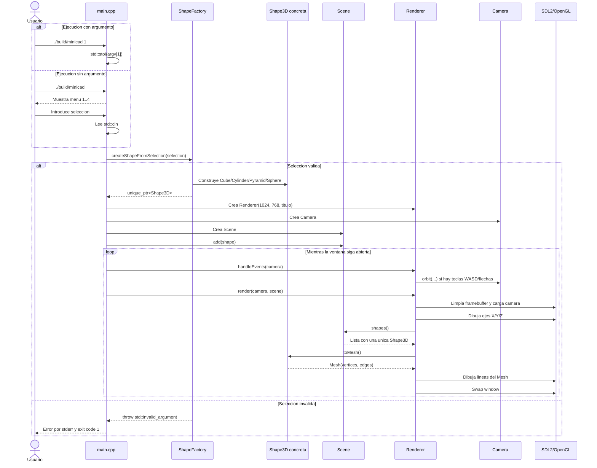

# MiniCAD Shape Selection Sequence Diagram

Este diagrama muestra el flujo principal del visor interactivo: seleccion de figura, creacion de escena y renderizado de una unica malla generica.

```mermaid
sequenceDiagram
    actor User as Usuario
    participant Main as main.cpp
    participant Factory as ShapeFactory
    participant Shape as Shape3D concreta
    participant Scene as Scene
    participant Renderer as Renderer
    participant Camera as Camera
    participant OpenGL as SDL2/OpenGL

    alt Ejecucion con argumento
        User->>Main: ./build/minicad 1
        Main->>Main: std::stoi(argv[1])
    else Ejecucion sin argumento
        User->>Main: ./build/minicad
        Main-->>User: Muestra menu 1..4
        User->>Main: Introduce seleccion
        Main->>Main: Lee std::cin
    end

    Main->>Factory: createShapeFromSelection(selection)

    alt Seleccion valida
        Factory->>Shape: Construye Cube/Cylinder/Pyramid/Sphere
        Factory-->>Main: unique_ptr<Shape3D>
        Main->>Renderer: Crea Renderer(1024, 768, titulo)
        Main->>Camera: Crea Camera
        Main->>Scene: Crea Scene
        Main->>Scene: add(shape)

        loop Mientras la ventana siga abierta
            Main->>Renderer: handleEvents(camera)
            Renderer->>Camera: orbit(...) si hay teclas WASD/flechas
            Main->>Renderer: render(camera, scene)
            Renderer->>OpenGL: Limpia framebuffer y carga camara
            Renderer->>OpenGL: Dibuja ejes X/Y/Z
            Renderer->>Scene: shapes()
            Scene-->>Renderer: Lista con una unica Shape3D
            Renderer->>Shape: toMesh()
            Shape-->>Renderer: Mesh(vertices, edges)
            Renderer->>OpenGL: Dibuja lineas del Mesh
            Renderer->>OpenGL: Swap window
        end
    else Seleccion invalida
        Factory-->>Main: throw std::invalid_argument
        Main-->>User: Error por stderr y exit code 1
    end
```
